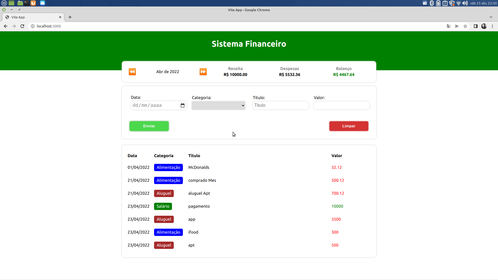

# Sistema financeiro Vite@React


Application of a financial system,
where separates by month, field validation filter
<hr>
<h2>Technology used</h2>
- Reactjs<br>
- TypeScript<br>
- Styled-components<br>
- hooks<br>
- Vite@

<p>contribute project</p>

```
git clone https://github.com/herickcamara/ReactFinanceVite.git

```

<p>Start project</p>

```
npm install

```

<p>run the project</p>

```
npm run dev

```

<footer>Show<footer>